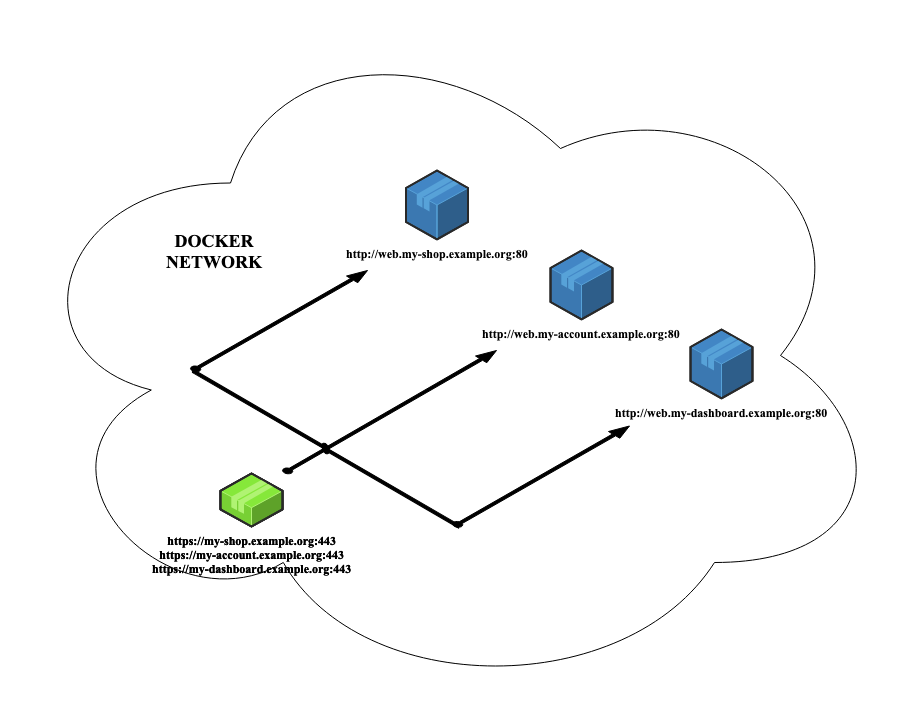
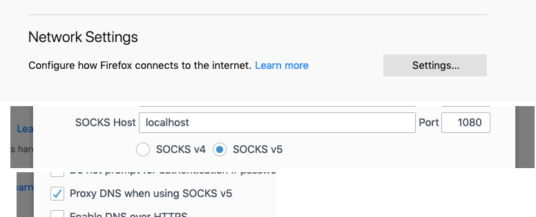

# What is this?

This is a container you can drop in a docker network that will proxy HTTPS traffic to your other containers.

The proxy container will need aliases to tell it which domain to respond to and will proxy the request to the same
address prefixed by `web.`



# But why?

Sometimes you want to test including the SSL stack.  Browsers will show you warnings when accessing insecure url and
that can cause overlooking some bugs related to https in your applications.

# WARNING

You need a valid wildcard certificate for the domain you will use, trusted by official authorities

```
*.yourdomain.example
```


# USAGE

## Setup your certificates

Place your certificates in a folder, and call them
```
ssl.crt
ssl.key
```


#### -> Using volumes

on `docker run` use `-v "<your folder>:/etc/nginx/certs/"`
in docker-compose use
```
    volumes:
      - <your folder>:/etc/nginx/certs/
```

#### -> Using an image and internal registry

**DO NOT PUBLISH AN IMAGE TO DOCKERHUB CONTAINING YOUR OWN CERTIFICATES**

```
FROM lindycoder/docker-instant-https-proxy:latest
ADD <your folder>/ /etc/nginx/certs/
```

## Setup the container

#### -> Using `docker-compose`

Set up a network in your `docker-compose.yml`
```
networks:
  my-network: {}
```

Add the proxy with the *host* it should respond to (replace `example.org` by your domain for which your certificate was issued)

```
services:
  docker-instant-https-proxy:
    image: lindycoder/docker-instant-https-proxy:latest
    networks:
      my-network:
        aliases:
        - my-app.example.org
```

And add an `alias` to your app so that it answers to the same *host* prefixed by `.web`

```
services:
  my-app:
    networks:
      my-network:
        aliases:
        - web.my-app.example.org
```

## Use the HTTPS

#### -> Using a socks5 proxy

Add a socks5 proxy to your network, such as `serjs/go-socks5-proxy`

```
  socks5-proxy:
    image: serjs/go-socks5-proxy
    networks:
      my-network:
    ports:
      - "1080:1080"
```

##### With your browser

Then you set up your browser to use `localhost:1080` as a *socks5* proxy, make sure to enable DNS over the proxy,
here's the Firefox settings for reference:



Then just access `https://my-app.example.org`

##### With CURL

```
curl -x socks5h://localhost:1080 https://my-app.example.org
```

##### With python's `requests`

*Requires `pip install "requests[socks]"` to work*

```
import os
import requests

os.environ["HTTPS_PROXY"] = "socks5h://localhost:1080"

requests.get("https://my-app.example.org")
```

#### -> Using port binding and /etc/hosts
/
Add a port to the proxy

```
services:
  docker-instant-https-proxy:
    ports:
      - "443:443"
```

Update your `/etc/hosts` and add

```
127.0.0.1 my-app.example.org
```

Then access `https://my-app.example.org` by all means you usually do :)


# Contributing / testing

Tests uses a self signed certificate so it is tested using --insecure.

`
./test.sh
`

Requires only docker installed.

Thank you for your interest!
